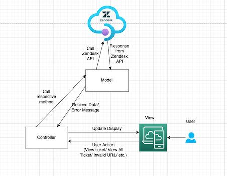
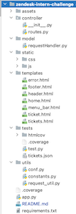
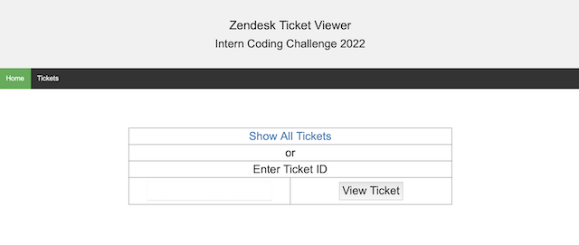
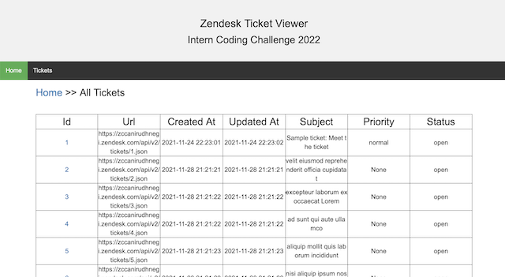
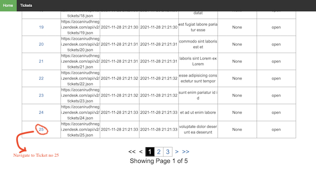
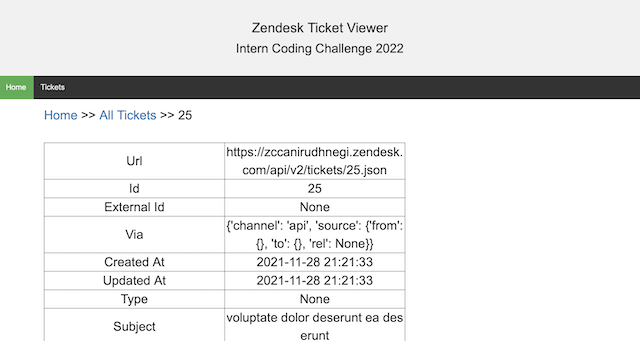
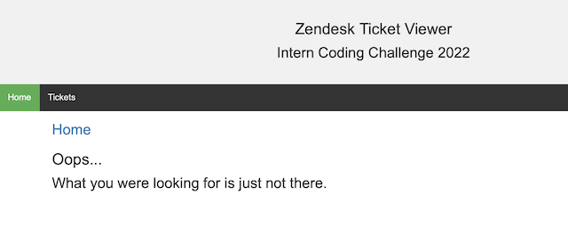
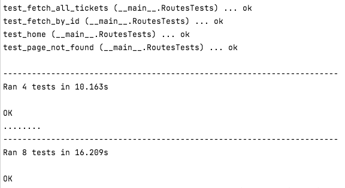
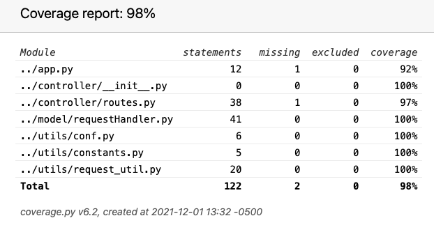
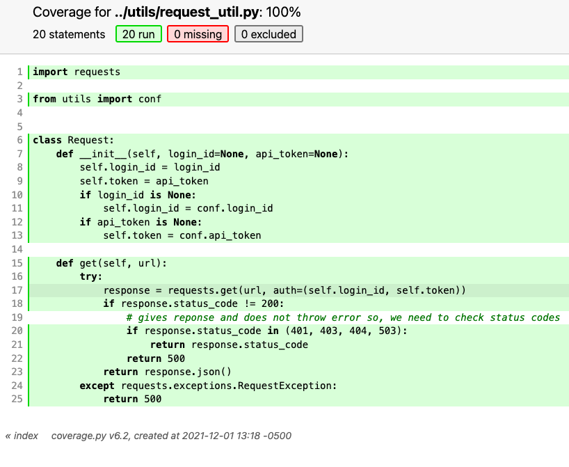

# Zendesk Intern Challenge 2022: Zendesk Ticket Viewer
In this challenge, I have built a ticket viewer webapp using flask, html, css, javascript using zendesk api.
The app follows MVC architecture limited to fetch only events as per the challenge rules.
1. Model: Fetches data from Zendesk API.
2. View: Displays the appliction UI.
3. Controller: Handle user interaction and connects model with application UI.
<br><br>
 

### Project Structure
<table>
   <tr> 
      <td>



</td>
<td>
1. Model: model/requestHandler.py contains all the methods for model.<br>
2. View: templates/ and static/ contains all required html,css & js files for view. <br>
3. Controller:  controller/routes.py contains all the required methods for controller.<br>
4. Unit Tests:  tests/test.py contains all the test cases.<br>
5. Coverage of test cases can be found in tests/htmlcov directory.<br>
6. Utils: contains constants, configurations and request utils.
</td>
</tr>
</table>

### Installation & Setup
### Requirements: 
Python 3 : Latest version can be found on https://www.python.org/downloads/ <br>
OS: Windows/linux/macOS

If pip is not bundled with python3, follow instructions here: https://pip.pypa.io/en/stable/cli/pip_install/
and install the required libraries by running this command from the zendesk-intern-challenge directory:
```
pip install -r requirements.txt 
```
If you do not wish to install pip, you can run this command instead:
```
python3 -m pip install -r requirements.txt 
```
### Running the app
1. Go to zendesk-intern-challenge directory.
2. Run the following command to start the app:
```
python3 app.py
```
You will see this message on terminal/command prompt:
```
 * Serving Flask app "app" (lazy loading)
 * Environment: production
   WARNING: This is a development server. Do not use it in a production deployment.
   Use a production WSGI server instead.
 * Debug mode: on
 * Running on http://localhost:9000/ (Press CTRL+C to quit)
 * Restarting with stat
 * Debugger is active!
 * Debugger PIN: 648-302-220
```
**NOTE:** make sure the port 9000 is available. If not, the app will fail to start. In that case, change the port in app.py and re-start the app with the above command.
<br>
Now, go to the browser and navigate to http://localhost:9000/
<br>
This will open the Zendesk Ticket Viewer app. In this app, we can view all the tickets in the account. We can also specify individual ticket id to see its details in the home screen.
<br><br>

### View All Tickets

<br><br>
The app also has pagination, each page shows 25 pages at max.
Within the list, we can click on the ticket id to view the data.
<br><br>


### View Single Ticket

<br><br>
The navigation in the top menu also helps to navigate to pages.
Error handling is done to avoid any unwanted error to be displayed.
<br><br>


### RUNNING TEST CASES WITH COVERAGE MODULE:
1. install coverage module: <br/>
``` pip3 install coverage ``` <br/>
2. Go to tests directory <br/>
3. Run the tests : <br/>
   ``` coverage run test.py ``` <br/>
<br><br>

<br>
4. report the test coverage for all the scripts : <br/>
   ``` coverage html */*.py ``` <br/>
5. A new directory will be created named **'htmlcov'**<br/>
6. Open **htmlcov/index.html** in a browser. It shows the % coverage of test cases in each script.
<br><br>

<br>
7. You can click on individual script for details.
<br><br>

<br>
